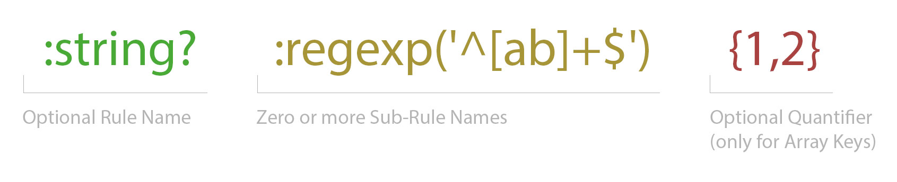

[](https://packagist.org/packages/lezhnev74/pasvl)
[](https://travis-ci.org/lezhnev74/pasvl)
[](https://packagist.org/packages/lezhnev74/pasvl)
[](https://packagist.org/packages/lezhnev74/pasvl)

# PASVL - PHP Array Structure Validation Library

Think of a regular expression `[ab]+` which matches a string `abab`. Now imaging the same for arrays.

The purpose of this library is to validate an existing (nested) array against a template and report a mismatch. 
It has the object-oriented extendable architecture to write and add custom validators.

**Note to current users**: this version is not backwards compatible with the previous 0.5.6. 

## Installation
```
composer require lezhnev74/pasvl
```

## Example

Refer to files in `Example` folder.

## Usage

### Array Validation
```php
$pattern = [
    '*' => [
        'type' => 'book',
        'title' => ':string :contains("book")',
        'chapters' => [
            ':string :len(2) {1,3}' => [
                'title' => ':string',
                ':exact("interesting") ?' => ':bool',
            ],
        ],
    ],
];

$data = [
    [
        'type' => 'book',
        'title' => 'Geography book',
        'chapters' => [
            'eu' => ['title' => 'Europe', 'interesting' => true],
            'as' => ['title' => 'America', 'interesting' => false],
        ],
    ],
    [
        'type' => 'book',
        'title' => 'Foreign languages book',
        'chapters' => [
            'de' => ['title' => 'Deutsch'],
        ],
    ],
];

$builder = \PASVL\Validation\ValidatorBuilder::forArray($pattern);
$validator = $builder->build();
try {
    $validator->validate($data); // the array is valid
} catch (ArrayFailedValidation $e) {
    echo "failed: " . $e->getMessage() . "\n";
}
```

### Optional String Validation
```php
$pattern = ":string :regexp('^[ab]+$')";
$builder = \PASVL\Validation\ValidatorBuilder::forString($pattern);
$validator = $builder->build();
$validator->validate("abab"); // the string is valid
$validator->validate("abc"); // throws RuleFailed exception with the message: "string does not match regular expression ^[ab]+$"
```

## Validation Language
This package supports a special dialect for validation specification.
It looks like this:



#### Short language reference:
- **Rule Name**
  Specify zero or one Rule Name to apply to the data. Optinal postfix `?` allows data to be `null`.
  Refer to the set of built-in rules in `src/Validation/Rules/Library`. For custom rules read below under `Custom Rules`.
  For example, `:string?` describes strings and `null`.  
- **Sub-Rule Name**
  Specify zero or more Sub-Rule Names to apply to the data AFTER the Rule is applied. Sub Rules are extra methods of the main Rule.
  For example, `:number :float` describes floats.
- **Quantifier**
  Specify quantity expectations for data keys. If none is set then default is assumed - `!`.
  Available quantifiers:                       
  - `!` - one key required (default)
  - `?` - optional key
  - `*` - any count of keys
  - `{2}` - strict keys count
  - `{2,4}` - range of keys count
  
  For example:
  ```php
    $pattern = [":string *" => ":number"];
    // the above pattern matches data:
    $data = ["june"=>10, "aug" => "11"];
  ```

#### Pattern Definitions
- as exact value
  ```php
  $pattern = ["name" => ":any"]; // here the key is the exact value
  $pattern = ["name?" => ":any"]; // here the key is the exact value, can be absent as well
  $pattern = [":exact('name')" => ":any"]; // this is the same
  ```
- as nullable rule
  ```php
  $pattern = ["name" => ":string?"]; // the value must be a string or null
  ```
- as rule with subrules
  ```php
  $pattern = ["name" => ":string :regexp('\d*')"]; // the value must be a string which contains only digits
  ```
- as rule with quantifiers
  ```php
  $pattern = [":string {2}" => ":any"]; // data must have exactly two string keys
  ```

#### Compound Definitions
This package supports combinations of rules, expressed in a natural language.
Examples:
- `:string or :number`
- `:string and :number`
- `(:string and :number) or :array`

There are two combination operators: `and`, `or`. 
`and` operator has precedence. 
Both are left-associative. 

## Custom Rules
By default, the system uses only the built-in rules. However you can extend them with your own implementations.
To add new custom rules, follow these steps:
- implement your new rule as a class and extend it from `\PASVL\Validation\Rules\Rule`
- implement a new rule locator by extending a class `\PASVL\Validation\Rules\RuleLocator`
- configure your validator like this:
  ```php
  $builder = ValidatorBuilder::forArray($pattern)->withLocator(new MyLocator()); // set your new locator
  $validator = $builder->build();
  ```
## Hints
- PHP casts "1" to 1 for array keys:
  ```php
  $data = ["12" => ""];
  $pattern_invalid = [":string" => ""];
  $pattern_valid = [":number :int" => ""];
  ```

## 🏆 Contributors
- **[Greg Corrigan](https://github.com/corrigang)**. Greg spotted a problem with nullable values reported as invalid.
- **Henry Combrinck**. Henry tested the library extensively on real data and found tricky bugs and edge cases. Awesome contribution to make the package valuable to the community.
- **[@Averor](https://github.com/Averor)**. Found a bug in parenthesis parsing.   

## License
This project is licensed under the terms of the MIT license.

