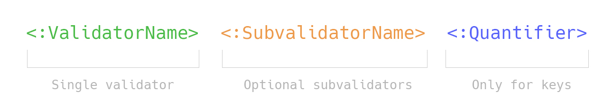

[](https://packagist.org/packages/lezhnev74/pasvl)
[](https://travis-ci.org/lezhnev74/pasvl)
[](https://packagist.org/packages/lezhnev74/pasvl)
[](https://raw.githubusercontent.com/lezhnev74/pasvl/master/LICENSE)


# PASVL - PHP Array Structure Validation Library 

The purpose of this library is to validate an existing (nested) array against a template and report a mismatch. 
It has the object-oriented extendable architecture to write and add custom validators.


Highly inspired by abandoned package [ptrofimov/matchmaker](https://github.com/ptrofimov/matchmaker). While the mentioned package was written in a functional way, current one embraces OO architecture in a sake of readability, maintainability, and extendability.  

## Installation
```
composer require lezhnev74/pasvl
```

## Examples

Refer to files in `Examples` folder. 

### Example 1. Data does not match the pattern

```php
// import fully qualified class names to your namespace
use PASVL\Traverser\VO\Traverser;
use PASVL\ValidatorLocator\ValidatorLocator;

$data = ["password"=>"weak"];
$pattern = ["password" => ":string :min(6)"];

$traverser = new Traverser(new ValidatorLocator());
$result = $traverser->check($pattern, $data); // returns false 
```

### Example 2. Data matches the pattern

```php
// import fully qualified class names to your namespace
use PASVL\Traverser\VO\Traverser;
use PASVL\ValidatorLocator\ValidatorLocator;


$data = [
   [
       'type' => 'book',
       'title' => 'Geography book',
       'chapters' => [
           'eu' => ['title' => 'Europe', 'interesting' => true],
           'as' => ['title' => 'America', 'interesting' => false],
       ],
   ],
   [
       'type' => 'book',
       'title' => 'Foreign languages book',
       'chapters' => [
           'de' => ['title' => 'Deutsch'],
       ],
   ],
];

$pattern = [
    '*' => [
        'type' => 'book',
        'title' => ':string :contains(book)',
        'chapters' => [
            ':string :length(2) {1,3}' => [
                'title' => ':string',
                'interesting?' => ':bool',
            ],
        ],
    ],
];

$traverser = new Traverser(new ValidatorLocator());
$result = $traverser->check($pattern, $data); // returns true
```

## Pattern 

An array consists of keys and values. A pattern can set expectations for both.



A pattern consists of a 3 parts:
- main validator: `:string`
- optional sub-validators: `:min(2) :max(4)`
- quantifier (for keys only): `{1,2}`

Example: `:string :min(1) :max(4) {1,2}`.

### Pattern definition

A pattern can be set in a few ways:
- **as an explicit key name:**
    ```php
    $pattern = ["name"=>"Nico"]
    ```
- **as an explicit optional key name:**
    ```php
    // array can have optional key "name"
    $pattern = ["name?"=>"Nico"]
    ```
- **as validators list:**
    ```php
    //array can have any number of string keys of exactly 4 bytes long
    // here "string" - main validator, "len" - sub-validator
    $pattern = [":string :len(4)"=>"Nico"]
    ```
    In this case no other symbols are allowed except validator names and arguments. Invalid pattern: `:string name`.
- **as validators list with quantifier:**
    ```php
    //array can have any count (zero or more) string keys matching given regexp (frist_name or last_name)
    //please note, that closing parenthesises within regex MUST be escaped in order to work correctly: 
    $pattern = [":string :regexp(/(first|last\)_name/\) *"=>":string"]
    ```

#### Quantifier definition
A quantifier set expectations on keys. If none is set then default is assumed - `!`. 

Available quantifiers:
- `!` - one key required (**default**)
- `?` - optional key
- `*` - any count of keys
- `{2}` - strict keys count
- `{2,4}` - range of keys count

    
### Validator definition
A validator is a class which has single `__invoke($data)` method and optional methods acting as sub-validators.
A pattern can have a single main validator name and any number of sub-validators. Validator's definition must start with `:` and then the name follows. 

Validators and sub-validators can have arguments: `:between(1,10)` (but empty brackets are not allowed). Validator and sub-validator names follow the same rules as any [PHP label](http://www.php.net/manual/en/language.variables.basics.php):
```
/^[a-zA-Z_\x7f-\xff][a-zA-Z0-9_\x7f-\xff]*$/
```

If given pattern does not match the above description, then it is used as an implicit value:
```php
// This pattern matches only if data has key ": string"
$pattern = [
    ": string" => ":any"
];
``` 

#### Validator lookup
Built-in validator are found automatically. In case you want to use your own validator class, extend `ValidatorLocator` class and add your logic to locate validator classes. Refer to folder `src/Validator`.

## Hints

- PHP [casts](http://www.php.net/manual/en/language.types.array.php) "1" to 1 for array keys:
    ```php
    $data = ["12"=>""];
    $pattern_invalid = [":string"=>""];
    $pattern_valid = [":int"=>""];
    ```

## 🏆 Contributors
- **Henry Combrinck**. Henry tested the library extensively on real data and found tricky bugs and edge cases. Awesome contribution to make the package valuable to the community.
- **[@Averor](https://github.com/Averor)**. Found a bug in parenthesis parsing.   

## License
This project is licensed under the terms of the MIT license.

## TODO
- Add validator classes
- Add more real-world examples
- Improve README
